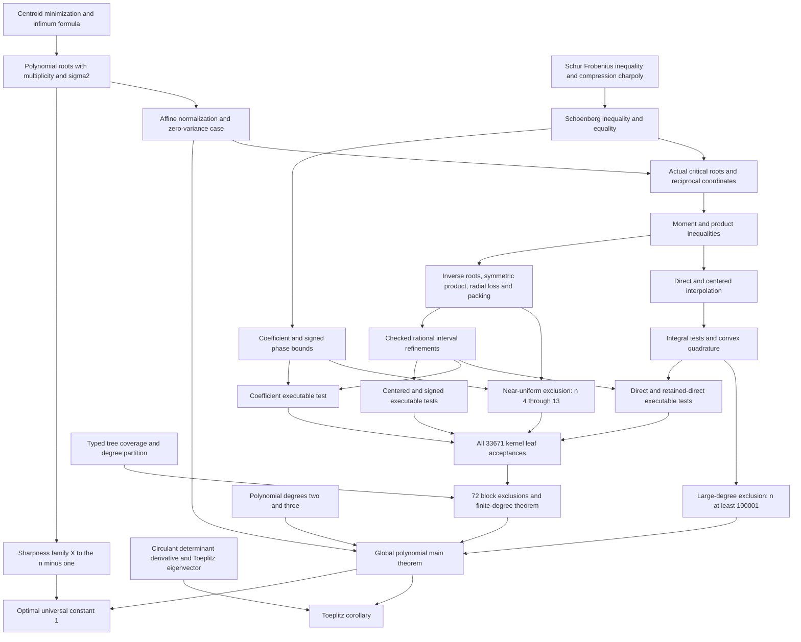

# Dependency graph

All mathematical nodes below are proved and included in the completed project.

The final audit reports 760 selected project declarations, solution and all 217 public proof declarations in the reused modules: 978 closures in total. Auditing each block exclusion and the main theorem includes the generated numerical proof dependencies transitively. The 640 acceptance modules and all 33,671 leaf proofs have compiled.

The diagram groups related lemmas for readability; the precise imports and proof dependencies are in the Lean sources. Schoenberg equality and sharpness are proved companion results. Python generators, certificate hashes and numerical replay reports are outside the mathematical proof graph.
